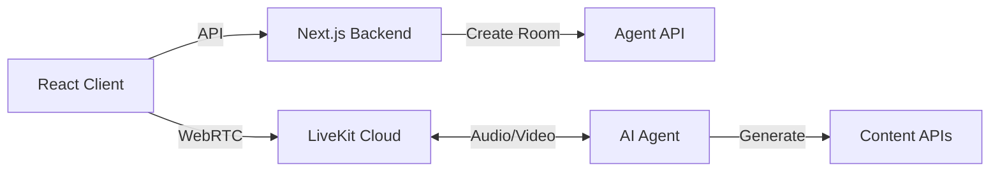

# StayReel 🎬

> Real-time AI conversations with multi-modal content generation

[](https://demo.heytricia.ai)
[](https://discord.gg/stayreel)
[](LICENSE)

StayReel transforms conversations into visual stories. Built on LiveKit WebRTC, it enables real-time voice interactions with AI agents that generate images, videos, and reels on the fly.

## 🚀 Quick Start

### Tricia Community Members

If you have access to the Vercel project:

```bash
# Clone and setup
git clone git@github.com:Tricia-42/StayReel.git
cd StayReel
npm install

# Pull environment variables
vercel link
vercel env pull .env.local

# Run locally
npm run dev
```

Visit http://localhost:8005 and sign in with Google.

### External Contributors

```bash
# Clone repository
git clone git@github.com:Tricia-42/StayReel.git
cd StayReel
npm install

# Setup environment
cp .env.example .env.local
# Edit .env.local with your credentials

npm run dev
```

#### Required Services

1. **Google OAuth**: [Create credentials](https://console.cloud.google.com/apis/credentials)
   - Add redirect URI: `http://localhost:8005/api/auth/callback/google`

2. **Firebase** (optional): For user persistence
   - Download service account JSON
   - Or add credentials to `.env.local`

3. **Agent Backend**: Any LiveKit-compatible agent
   - Default: Tricia AI API
   - Or build your own (see below)

## 🏗️ Architecture



## 🎯 Current Features

- **Voice Conversations**: Real-time WebRTC audio with AI agents
- **Live Transcription**: See what you and the AI are saying
- **Session Recording**: Automatic conversation history
- **Multi-turn Context**: Agents remember your conversation
- **Google Sign-in**: Secure authentication with Firebase

## 🔮 Next Steps: Multi-Modal Generation

### 1. Google Veo3 Integration (Video Generation)

Enable short-form video creation during conversations:

```typescript
// src/lib/veo3-client.ts
export async function generateVideo(prompt: string, context: ConversationContext) {
  // Implement Veo3 API integration
  // Handle multi-turn refinement
  // Stream progress to client
}

// In your agent:
rpc.register("video.generate", async (params) => {
  const video = await veo3.generate(params.prompt, params.style)
  return { url: video.url, duration: video.duration }
})
```

### 2. OpenAI Multi-Turn Image Editing

Create reels through conversational image generation:

```typescript
// src/lib/openai-vision.ts
export async function createReel(messages: Message[]) {
  // DALL-E 3 for initial generation
  // GPT-4V for editing instructions
  // Chain multiple edits into reel sequence
}

// Frontend hook:
const { images, addFrame, editFrame } = useReelCreation()
```

### Implementation Roadmap

1. **Week 1-2**: Veo3 API integration
   - [ ] API client implementation
   - [ ] Streaming video preview
   - [ ] Multi-turn refinement UI

2. **Week 3-4**: Image reel creator
   - [ ] DALL-E 3 integration
   - [ ] Frame-by-frame editor
   - [ ] Export to video format

3. **Week 5-6**: Production features
   - [ ] CDN for media storage
   - [ ] Background processing
   - [ ] Social sharing

## 🛠️ Development

### Project Structure

```
src/
├── components/playground/  # LiveKit UI components
├── pages/api/             # Backend endpoints
├── lib/                   # API clients & utilities
└── hooks/                 # React hooks
```

### Key Integrations

- **LiveKit**: WebRTC infrastructure
- **NextAuth**: Authentication
- **Firebase**: User management
- **Tricia API**: Default AI agent

### Building Custom Agents

Your agent needs to:

1. Connect to LiveKit rooms
2. Process audio streams
3. Generate responses
4. Implement RPC methods

Example Python agent:

```python
from livekit.agents import JobContext, WorkerOptions, cli

async def entrypoint(ctx: JobContext):
    # Your agent logic here
    await ctx.connect()
    
cli.run_app(WorkerOptions(entrypoint_fnc=entrypoint))
```

## 📝 API Reference

### Create Session

```http
POST /api/tricia
{
  "title": "New Conversation"
}

Response:
{
  "room_name": "room_abc123",
  "participant_token": "jwt...",
  "server_url": "wss://livekit.server"
}
```

### RPC Methods

Register these in your frontend:

- `agent.journal_generated` - Content ready
- `video.progress` - Generation updates
- `image.frame_added` - Reel frame created

## 🤝 Contributing

We're looking for help with:

- [ ] Veo3 integration
- [ ] Image editing pipeline
- [ ] UI/UX improvements
- [ ] Agent examples
- [ ] Documentation

See [CONTRIBUTING.md](CONTRIBUTING.md) for guidelines.

## 📄 License

Apache 2.0 - see [LICENSE](LICENSE)

---

<p align="center">
  Built with ❤️ by <a href="https://heytricia.ai">Tricia AI</a> on <a href="https://livekit.io">LiveKit</a>
</p>


