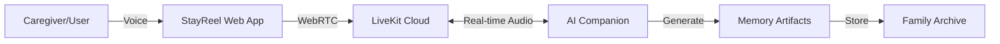

# StayReel 🎬

> Preserving memories through AI-powered conversations

[](https://demo.heytricia.ai)
[](LICENSE)

StayReel transforms conversations into lasting memories. Built by [Tricia, Inc](https://heytricia.ai), it's an open-source platform that helps people with dementia and their caregivers create meaningful connections through AI-guided storytelling and memory preservation.

---

## 🌐 Explore StayReel

- **Live Demo**: [demo.heytricia.ai](https://demo.heytricia.ai)
- **Company Website**: [heytricia.ai](https://heytricia.ai)
- **Join Our Slack Community**: [StayReel Developers](https://join.slack.com/t/stayreel-community/shared_invite/xyz)

---

## 🎯 Our Mission

At Tricia, we believe technology should strengthen human connections, not replace them. StayReel empowers:

- **People with dementia** to share their stories and preserve memories
- **Unpaid caregivers** to capture precious moments and understand their loved ones better
- **Families** to build a digital legacy that spans generations

## 🚀 Quick Start

### One-Command Setup

```bash
# Clone and run setup script
git clone git@github.com:Tricia-42/StayReel.git
cd StayReel
./scripts/setup.sh
```

The setup script will:
- Check Node.js version
- Install dependencies  
- Configure environment variables
- Provide next steps

### Manual Setup

#### Tricia Community Members

If you have access to the Vercel project:

```bash
git clone git@github.com:Tricia-42/StayReel.git
cd StayReel
npm install

# Pull environment variables
vercel link
vercel env pull .env.local

npm run dev
```

#### External Contributors

```bash
git clone git@github.com:Tricia-42/StayReel.git
cd StayReel
npm install

# Setup environment
cp .env.example .env.local
# Edit .env.local with your credentials

npm run dev
```

Visit http://localhost:8005 after starting the server.

---

## 🏗️ Architecture



---

## ✨ Core Features

- **Guided Conversations**: AI companions that gently prompt memory sharing
- **Real-time Transcription**: Capture every word for future generations
- **Memory Synthesis**: Transform conversations into shareable stories
- **Caregiver Tools**: Session notes, mood tracking, and care insights
- **Privacy First**: Your memories stay yours - fully encrypted and private

---

## 🔮 Roadmap: Multi-Modal Memories

### Phase 1: Visual Memory Creation (Q1 2025)

**Photo-to-Story Generation**
```typescript
// Transform old photos into narrated memories
export async function createPhotoMemory(photo: File, audioNarration: Blob) {
  // AI analyzes photo context
  // Combines with voice narration
  // Creates shareable memory video
}
```

### Phase 2: Memory Reel Builder (Q2 2025)

**Conversational Video Creation**
```typescript
// Build video reels through natural conversation
const { reel, addScene, narrate } = useMemoryReel()
// "Tell me about your wedding day..."
// AI helps reconstruct and visualize memories
```

### Phase 3: Legacy Platform (Q3 2025)

- Family member access controls
- Memory timeline visualization
- Care coordination features
- Integration with care facilities

---

## 🛠️ Technical Stack

```
src/
├── components/     # React UI components
├── pages/api/     # Backend API routes
├── lib/           # Core utilities
├── agents/        # AI companion logic
└── hooks/         # React hooks
```

**Key Technologies:**
- **LiveKit**: Real-time voice infrastructure
- **Next.js**: Full-stack React framework
- **AI Agents**: Customizable conversation companions
- **Secure Storage**: End-to-end encrypted memories

---

## 🤝 Contributing

We welcome contributions that align with our mission. Priority areas:

- **Accessibility**: Making StayReel easier for seniors
- **Caregiver Features**: Tools that reduce caregiver burden
- **Memory Formats**: New ways to preserve and share memories
- **Language Support**: Reaching more families globally
- **Clinical Integration**: Working with care professionals

See [CONTRIBUTING.md](CONTRIBUTING.md) for guidelines.

---

## 🔒 Privacy & Ethics

StayReel is built with privacy and dignity at its core:

- All conversations are encrypted
- Families own their data completely
- No training on user conversations
- Transparent AI interactions
- Caregiver consent protocols

---

## 📞 Get Involved

- **Developers**: Join our [Slack workspace](https://join.slack.com/t/stayreel-community/shared_invite/xyz)
- **Caregivers**: Share your needs at feedback@heytricia.ai
- **Researchers**: Collaborate at research@heytricia.ai
- **Care Facilities**: Partner with us at partnerships@heytricia.ai

---

## 📄 License

Apache 2.0 - see [LICENSE](LICENSE)

---

<p align="center">
  <strong>Building technology that preserves what matters most</strong><br>
  Made with ❤️ by <a href="https://heytricia.ai">Tricia, Inc</a>
</p>


