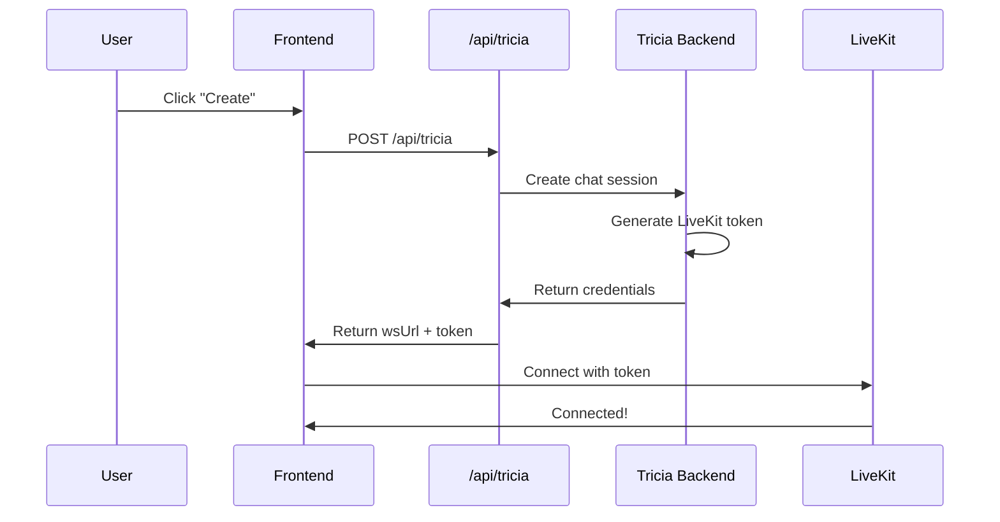

# LiveKit Architecture for FastReel

## Overview

FastReel uses a **token-based authentication** approach for LiveKit connections. Frontend developers do NOT need LiveKit accounts or API keys.

## How It Works



## What Frontend Developers Need

### 1. Environment Variables

```bash
# .env.local
TRICIA_BASE_URL=https://api.heytricia.ai
TRICIA_AUTH_TOKEN=your_auth_token  # Get from backend team
```

### 2. API Endpoint

The `/api/tricia` endpoint handles everything:

```typescript
// Frontend code
const response = await fetch('/api/tricia', {
  method: 'POST',
  body: JSON.stringify({ user_id: userId })
});

const data = await response.json();
// data contains:
// - participant_token: JWT for LiveKit
// - server_url: LiveKit WebSocket URL
// - room_name: Room to join
```

### 3. LiveKit Connection

```typescript
// Using the credentials from API
room.connect(data.server_url, data.participant_token);
```

## What You DON'T Need

❌ LiveKit Cloud account  
❌ LiveKit API keys  
❌ LiveKit dashboard access  
❌ WebSocket URLs in env vars  

## Security

- LiveKit credentials are NEVER exposed to the frontend
- Tokens are short-lived and room-specific
- Backend controls all access and permissions
- Agent dispatch is configured in the token by the backend

## For Backend Developers

The Tricia backend handles:
1. Storing LiveKit API credentials securely
2. Generating participant tokens with proper grants
3. Configuring agent dispatch in the room config
4. Managing room names and participant identities

## Testing Locally

1. Copy `.env.example` to `.env.local`
2. Get `TRICIA_AUTH_TOKEN` from the backend team
3. Run `npm run dev`
4. The app will automatically get LiveKit credentials from the backend

## Common Issues

### "Failed to connect to LiveKit"
- Check if the Tricia backend is accessible
- Verify your `TRICIA_AUTH_TOKEN` is valid
- Check browser console for specific errors

### "No agent in room"
- This is configured by the backend in the token
- Contact backend team to verify agent dispatch is enabled

## Questions?

Contact the backend team for:
- Access to staging/production Tricia API
- Valid auth tokens for development
- Help with connection issues 